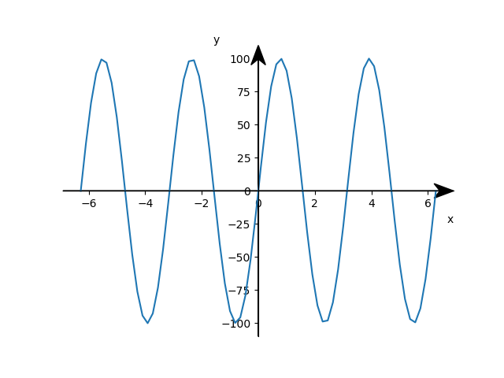

# Schoolplot

You want to use the great features of mathplotlib but need the axes not in the scientific way but a "school like"- way.   
This packages provides you with a short function, that moves the axis to the point (0,0) and puts arrowtips at the upper and right end.

## Installation

```
pip install -e . --user
```

## Usage

e.g.
```
import schoolplot
import pylab as plt #alternative matplotlib.pyplot
import numpy as np

# do the normal plotting with all features
X  = np.linspace(-2 * np.pi, 2 * np.pi, 70, endpoint=True)
F1 = 100*np.sin(2* X)
plt.plot(X, F1)
plt.xlabel("x", horizontalalignment='right',x = 1.0)
plt.ylabel("y",y = 1.0, rotation=0)


# change your axes-style
schoolplot.axes()

#show the plot
plt.show()
plt.savefig("greatpicture.png")
```



## Feature

- axes through (0,0)
- thick arrow
- simple inclusion into python script

## Disclaimer

This is a private project. I share the files to help others who want to do something similar. Although I have done this project to the best of my ability, I cannot guarantee that the software will work. Downloading and using is at your own risk.

## Feedback

I am grateful for feedback, bugs and feature requests. I will incorporate them into the project if necessary. If you want to extend the functionality or don't want to wait for me, feel free to fork this project.


## Contribution

This package ist based on the ideas of [Julien Spronck](https://stackoverflow.com/questions/33737736/matplotlib-axis-arrow-tip/33738359#33738359).
